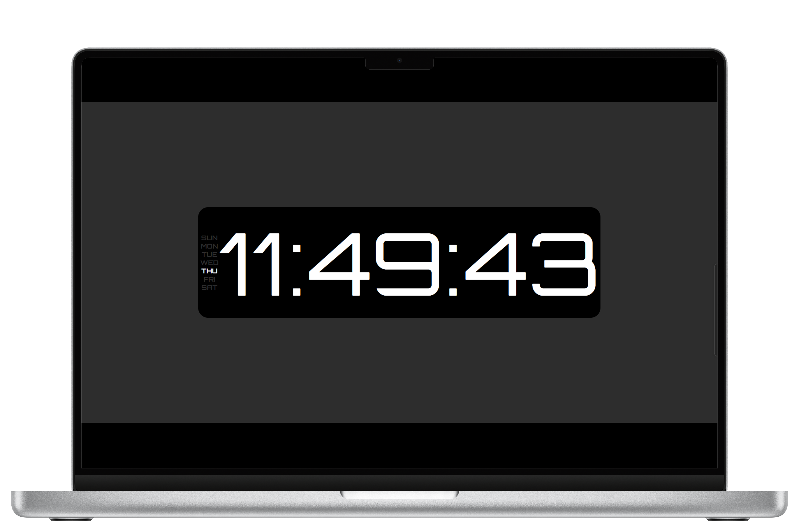

# Digital Clock



This is a digital clock that displays the current time.

## Usage

To run the digital clock, you need to have the [Web Toolkit](https://raw.githubusercontent.com/PatellAbhishekk/digital-clock/refs/heads/main/package.json) installed.

```bash
# Install the Vite
npm create vite@latest digital-clock

# Run the digital clock
npm run dev
```

## License


